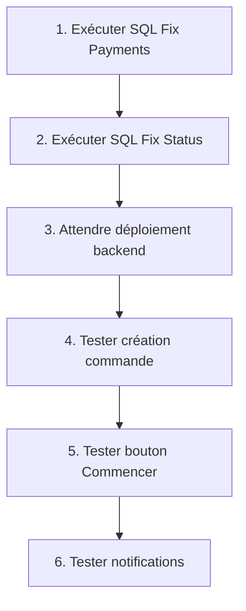

# 🔧 Problèmes Restaurant & Solutions

## 📍 Situation Actuelle

### ❌ Problèmes Identifiés

1. **Erreur 500 lors création de commande**
   - Message: `column "description" of relation "payments" does not exist`
   - Impact: Impossible de créer des commandes

2. **Bouton "Commencer" ne fonctionne pas**
   - Message: `API Error 500: Server error`
   - Impact: Impossible de changer le statut des commandes

3. **Notifications manquantes pour rôles restaurant**
   - Les 4 rôles restaurant ne reçoivent pas de notifications
   - Impact: Staff restaurant pas informé des nouvelles commandes/réservations

---

## ✅ Solutions

### Solution 1: Fix Colonne Description (Base de Données)

**Fichier SQL**: `database/FIX_PAYMENTS_DESCRIPTION.sql`

```sql
ALTER TABLE payments 
ADD COLUMN IF NOT EXISTS description TEXT;
```

**Action requise**: Exécuter dans Supabase SQL Editor

---

### Solution 2: Fix Contrainte Status (Base de Données)

**Fichier SQL**: `database/FIX_ORDER_STATUS_CONSTRAINT.sql`

```sql
ALTER TABLE restaurant_orders 
DROP CONSTRAINT IF EXISTS restaurant_orders_status_check;

ALTER TABLE restaurant_orders 
ADD CONSTRAINT restaurant_orders_status_check 
CHECK (status IN ('pending', 'confirmed', 'preparing', 'ready', 'served', 'completed', 'cancelled'));
```

**Action requise**: Exécuter dans Supabase SQL Editor

---

### Solution 3: Notifications Restaurant (Backend)

**Fichiers modifiés**:
- `server/src/services/notificationService.ts` - Ajout fonctions notifications restaurant
- `zen_backend/src/controllers/restaurantController.ts` - Intégration notifications

**Fonctions ajoutées**:
```typescript
// Notifications pour rôles restaurant
- notifyNewRestaurantOrder()       // Nouvelle commande → chef, manager
- notifyOrderStatusChange()        // Changement statut → serveur, cashier selon statut
- notifyNewTableReservation()      // Nouvelle réservation → manager, serveur
- notifyReservationCancelled()     // Annulation → manager
- notifyLowStock()                 // Stock faible → manager (futur)
```

**Distribution des notifications**:

| Événement | Qui reçoit la notification |
|-----------|----------------------------|
| Nouvelle commande | admin, manager, restaurant_manager, restaurant_chef |
| Commande prête | admin, manager, restaurant_manager, restaurant_server |
| Commande terminée | admin, manager, restaurant_manager, restaurant_cashier |
| Nouvelle réservation | admin, manager, restaurant_manager, restaurant_server |
| Annulation | admin, manager, restaurant_manager |

**Status**: ✅ Code ajouté, ⏳ En attente déploiement

---

## 📋 Plan d'Action Complet

### Étape 1: Fixes Base de Données (TOI) 🔧

**Temps**: 2 minutes

1. Ouvrir https://supabase.com → SQL Editor
2. Exécuter `FIX_PAYMENTS_DESCRIPTION.sql`
3. Exécuter `FIX_ORDER_STATUS_CONSTRAINT.sql`

**Instructions détaillées**: `EXECUTER_MAINTENANT_2_FIXES.md`

### Étape 2: Déploiement Backend (MOI) 🚀

**Temps**: 5 minutes (automatique)

1. Commit modifications notificationService
2. Push vers GitHub
3. Render redéploie automatiquement

### Étape 3: Tests (TOI) ✅

**Temps**: 5 minutes

1. **Test Création Commande**:
   - Restaurant > + Nouvelle Commande
   - Remplir et soumettre
   - ✅ Devrait fonctionner

2. **Test Bouton Commencer**:
   - Cliquer "Commencer" sur commande
   - ✅ Statut passe à "En préparation"

3. **Test Notifications**:
   - Créer commande en tant que admin/manager
   - Se connecter en tant que restaurant_chef
   - ✅ Notification visible

---

## 🔄 Ordre d'Exécution



---

## 📊 État d'Avancement

| Tâche | Status | Responsable |
|-------|--------|-------------|
| Fix SQL Payments | ⏳ À faire | Utilisateur |
| Fix SQL Status | ⏳ À faire | Utilisateur |
| Code Notifications | ✅ Fait | AI |
| Déploiement Backend | ⏳ En attente SQL | Auto |
| Tests | ⏳ Après déploiement | Utilisateur |

---

## 🎯 Résultats Attendus

### Après Tous les Fixes:

✅ **Création commandes**: Fonctionne sans erreur  
✅ **Bouton Commencer**: Change statut à "preparing"  
✅ **Boutons statut**: Prête, Servir, Terminer visibles  
✅ **Notifications Chef**: Reçoit nouvelles commandes  
✅ **Notifications Serveur**: Reçoit "commande prête"  
✅ **Notifications Cashier**: Reçoit "commande terminée"  
✅ **Notifications Manager**: Reçoit tout  

---

## 📞 Support

### Si ça ne marche toujours pas:

1. **Vérifier logs Render**:
   - https://dashboard.render.com
   - Service: zen-backend
   - Onglet "Logs"

2. **Vérifier console navigateur**:
   - F12 → Console
   - Chercher erreurs rouges

3. **Vérifier Supabase**:
   - Table payments: colonne description existe?
   - Table restaurant_orders: contrainte status OK?

---

## 🚀 Démarrage Rapide

**Instructions condensées**:

1. Ouvre Supabase SQL Editor
2. Copie contenu de `EXECUTER_MAINTENANT_2_FIXES.md`
3. Exécute les 2 scripts
4. Attends 5 minutes (déploiement)
5. Teste sur https://zen-lyart.vercel.app

**C'est tout!** 🎉

---

**Document de référence rapide**: `EXECUTER_MAINTENANT_2_FIXES.md`  
**Temps total estimé**: 15 minutes (SQL 2min + déploiement 5min + tests 5min + marge 3min)
