# 🎨 Hotel PMS - System Architecture Diagrams

## 1. 🏗️ System Architecture Overview

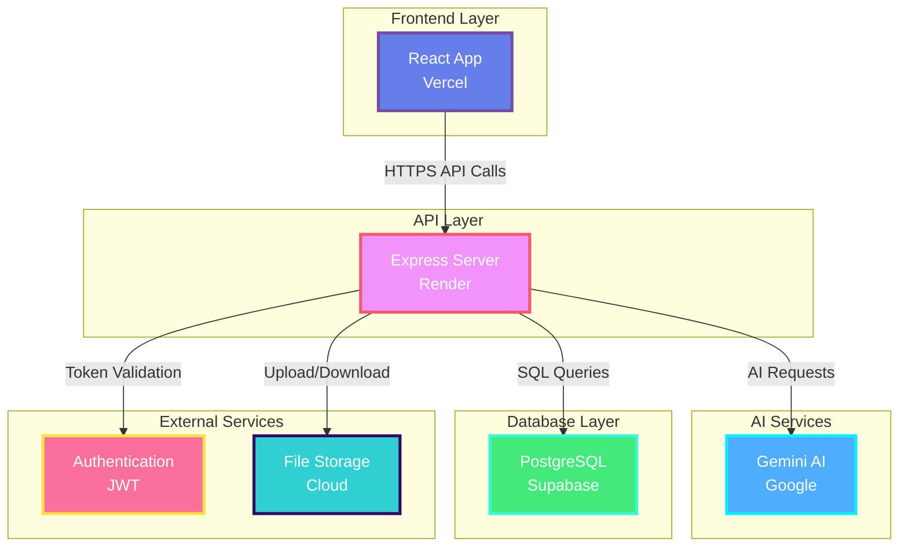

---

## 2. 🔄 Booking Workflow

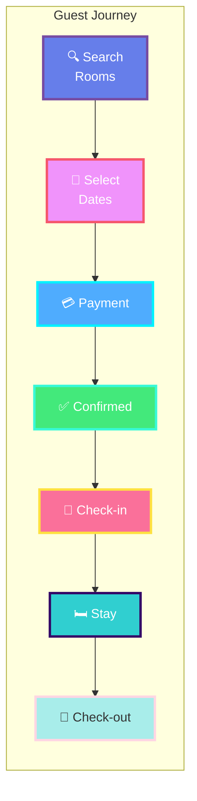

---

## 3. 🎯 User Roles & Permissions

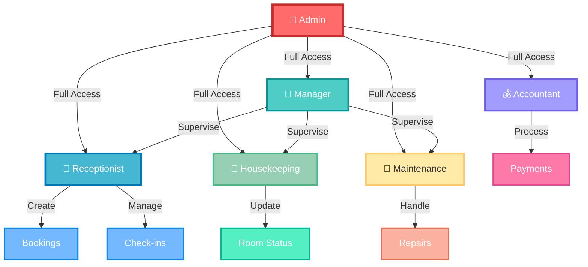

---

## 4. 🤖 AI Features Flow

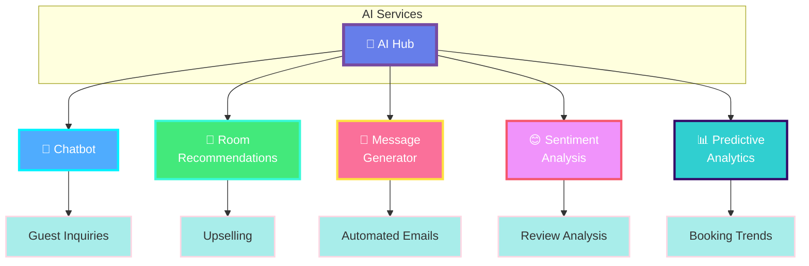

---

## 5. 🗄️ Database Schema

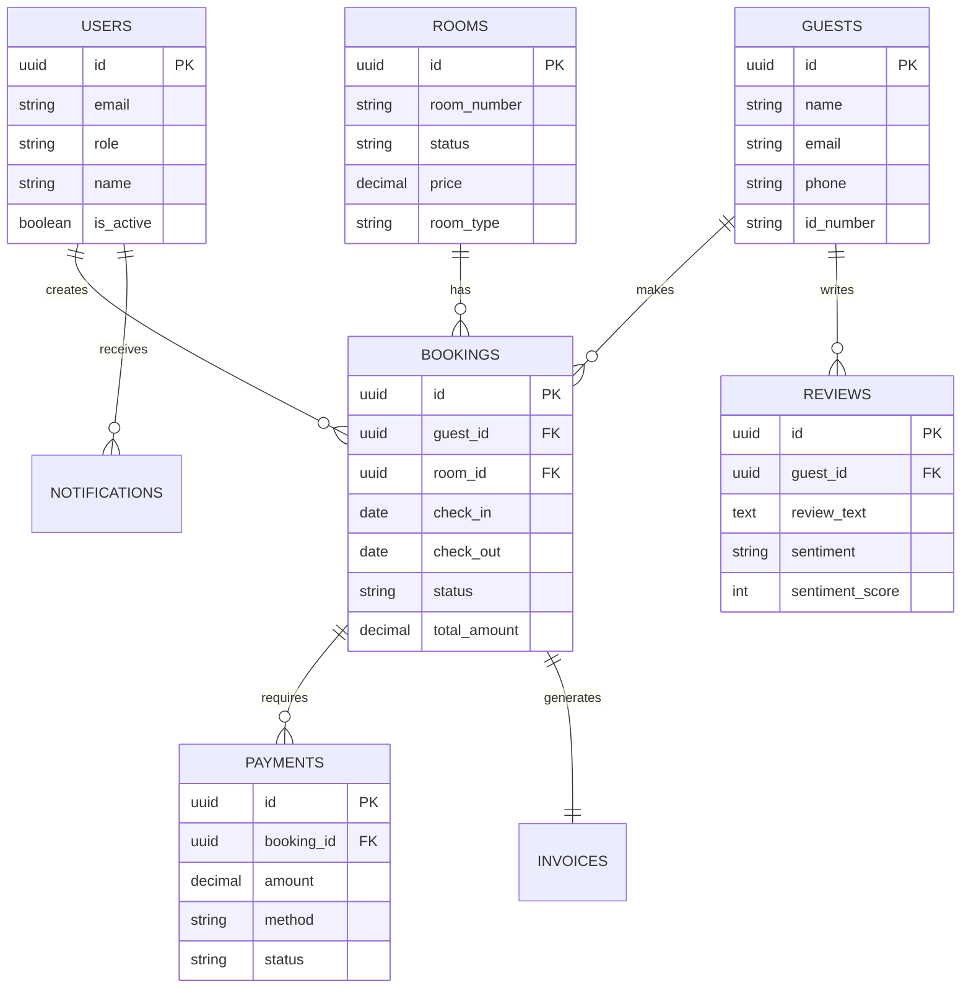

---

## 6. 🔐 Authentication Flow

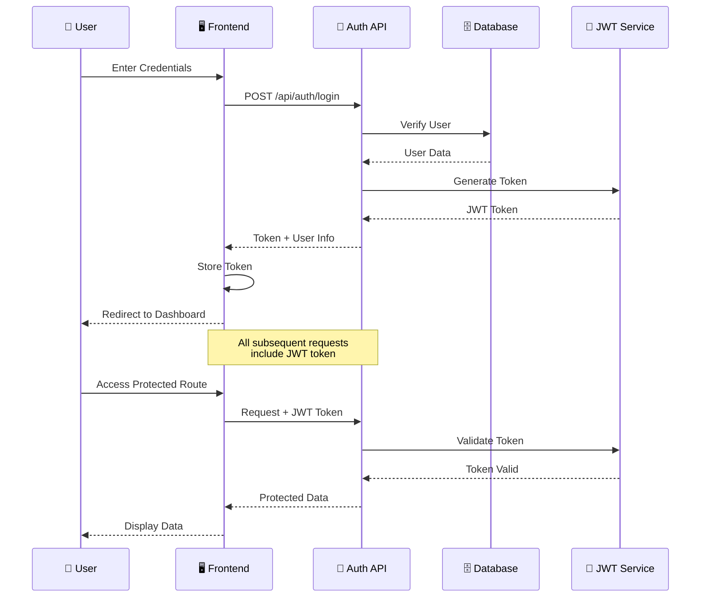

---

## 7. 🏨 Room Status Lifecycle

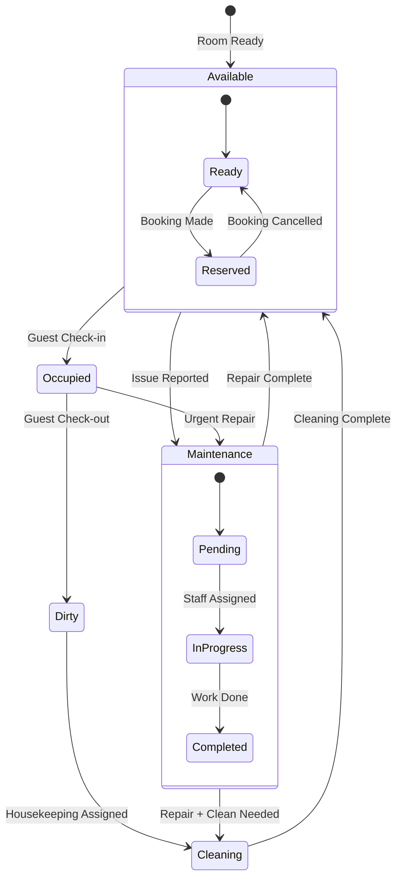

---

## 8. 💳 Payment Processing

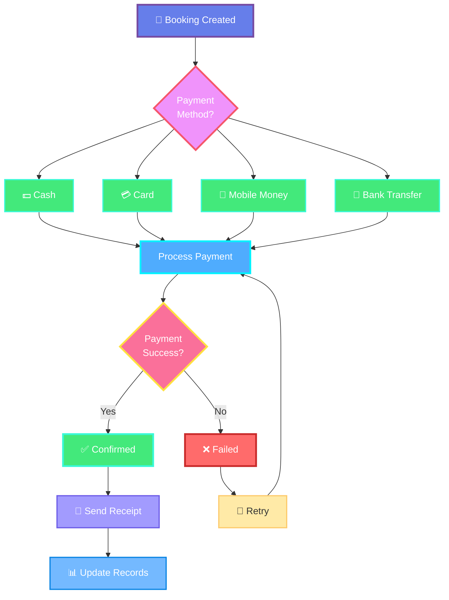

---

## 9. 📊 Dashboard Data Flow

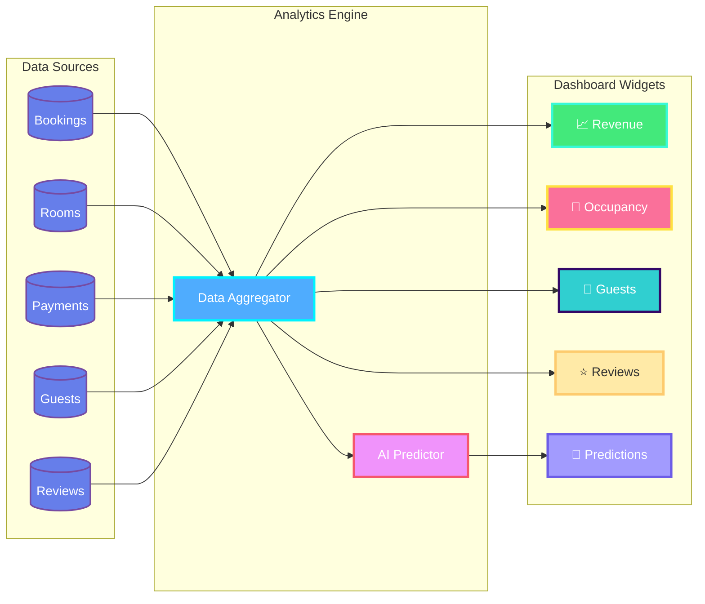

---

## 10. 🔔 Notification System

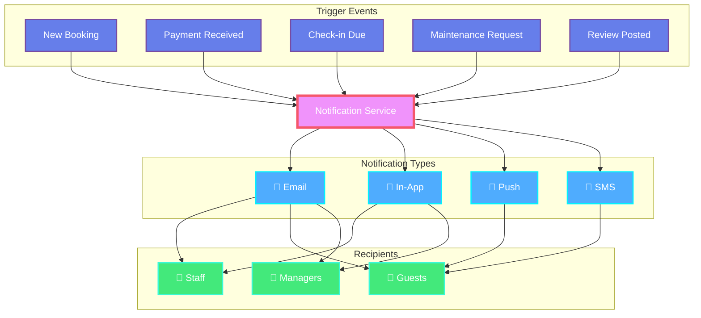

---

## 11. 🌐 Deployment Architecture

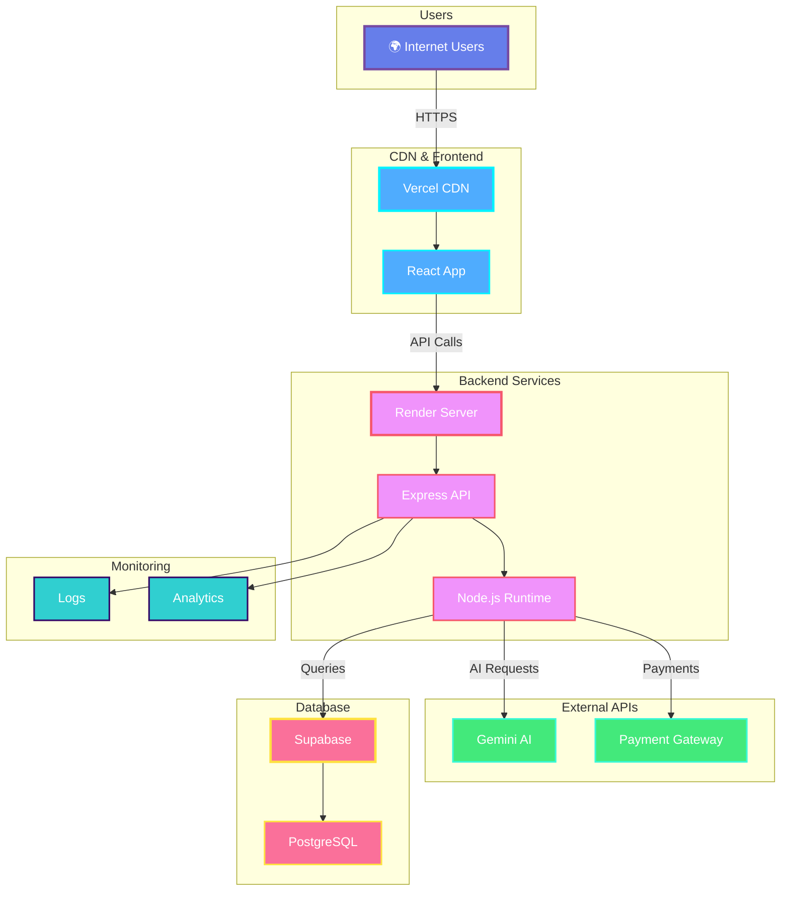

---

## 12. 📱 Mobile-First Design

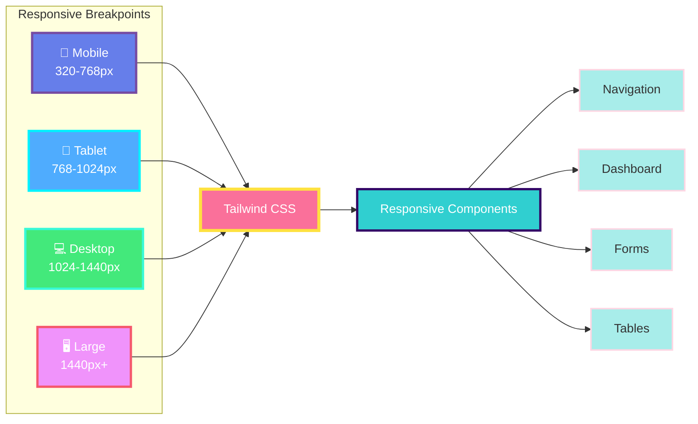

---

## Color Palette Reference

### Primary Colors
- 🔵 **Blue Gradient**: `#667eea → #764ba2` (Main Actions)
- 🟣 **Purple Gradient**: `#f093fb → #f5576c` (Secondary)
- 🔷 **Cyan Gradient**: `#4facfe → #00f2fe` (Info)
- 🟢 **Green Gradient**: `#43e97b → #38f9d7` (Success)
- 🔴 **Pink Gradient**: `#fa709a → #fee140` (Warnings)
- 🌊 **Teal Gradient**: `#30cfd0 → #330867` (Accent)

### Usage Guidelines
- **Admin/Critical**: Red tones
- **Success/Complete**: Green tones
- **Info/Data**: Blue/Cyan tones
- **Warnings**: Yellow/Orange tones
- **AI Features**: Purple/Pink tones
- **User Actions**: Teal/Cyan tones

---

**View these diagrams in:**
- GitHub (automatic rendering)
- VS Code (with Mermaid extension)
- Online: https://mermaid.live/

**Last Updated:** May 20, 2026
